<h3><code>sabba@github ~ $ ./contributions.sh</code></h3>

  

<h3><code>sabba@github ~ $ whoami</code></h3>

<table>
  <tr>
    <td valign="top"></td>
    <td valign="top"></td>
  </tr>
</table>

 

<h3><code>sabba@github ~ $ ls ~/building</code></h3>

| | | |
|---|---|---|
| **FiscEdge** | AI-powered company creation | [fiscedge.com](https://www.fiscedge.com) |
| **FiscEdge Academy** | Business & AI, as structured learning paths | [academy.fiscedge.com](https://academy.fiscedge.com) |
| **BuiltWithSabba** | Build log — what I ship, test and learn | [builtwithsabba.com](https://www.builtwithsabba.com) |
| **GIURIMI** | Legal education: civil liability, EU tech law | [giurimi.com](https://www.giurimi.com) |
| **The Italians** | Italian entrepreneurial storytelling | [the-italians.it](https://the-italians.it) |

 

<h3><code>sabba@github ~ $ cat ~/.contact</code></h3>

[alessiosabatino.it](https://www.alessiosabatino.it/en) · [LinkedIn](https://www.linkedin.com/in/alessio-sabatino29) · [alessio.sabatino@fiscedge.com](mailto:alessio.sabatino@fiscedge.com)

 

**How this page is built** — three self-contained animated SVGs, no third-party
stats services and no token. A photo becomes monochrome ASCII that types itself
in; the info card is hand-authored; the heatmap scrapes my own public
contribution calendar and a GitHub Action re-renders it daily. Everything is
generated by [five Python scripts](./scripts) in this repo, so the art is
committed here rather than rendered on someone else's server — it loads
instantly and cannot break with a 502.

